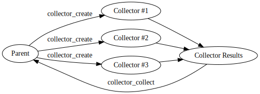

# Fork Collector 

A collector for adding multiple numbers via `fork`. Created for a university class.

# ToC
- [API](#api)
    - [Collector structs](#collector-structs)
    - [Collector functions](#collector-functions)
- [Implementation](#implementation)
    - [Collectors](#collectors)
        - [Creation](#creation)
        - [Collection](#collection)
- [Examples](#examples)
    - [Single collector](#single-collector)
    - [Multiple collectors](#multiple-collectors)
    - [Example program](#example-program)
- [Disclaimer](#disclaimer)

# API
## Collector structs
```c
struct collector {
    pid_t process_id;
    int readfd;
    int writefd;
    int outfd;
};
```
| field | description |
|-------|------------|
| process_id | The process ID of the collector |
| readfd     | The file descriptor to read from the collector |
| writefd | The file descriptor to write to the collector |
| outfd   | The file descriptor to read the final output from the collector |

```c
struct collector_result {
    pid_t process_id;
    uint64_t sum;
};
```
| field | description |
|-------|-------------|
| process_id | The process ID of the collector |
| sum        | The sum of all the values given to this collector |

## Collector functions
```c
struct collector collector_create(size_t expected)
```
Creates a collector which takes `expected` values until exiting and writing the final value to `outfd`.

```c
void collector_push(struct collector *collector, uint32_t val)
```
Push `val` onto the pointed collector `collector` to be processed.

```c
struct collector_result *collector_collect(struct collector* collectors, size_t n)
```
Return the value from `outfd` wrapped in `struct collector_result` of all `n` collectors from `collectors`.

# Implementation


Figure of collector relationships with the parent process.
## Collectors

### Creation
Collectors are the main idea behind this implementation. The main process can delegate computation tasks to multiple collectors by calling `collector_create`. These collectors will then collect new input from the parent until a limit is exceeded. New collectors are spawned via `fork`.

### Collection
The collector function `collector_collect` use `poll(2)` to all `outfd` in the `collectors` passed to the function to wait until collectors finish writing their values to `outfd`. 

# Examples
## Single collector
```c
#include <stdio.h>
#include "collector.h"

int main (void) {
    // create a collector that add 4 numbers
    struct collector collector COLLECTOR_CLEANUP = collector_create(4); 

    // Push 4 numbers to be added
    collector_push(&collector, 1);
    collector_push(&collector, 2);
    collector_push(&collector, 3);
    collector_push(&collector, 4);

    // ... the parent process is free to do anything here ...

    // poll for the result 
    struct collector_result *results = collector_collect(&collector, 1);

    // print the output
    printf("%ld\n", results[0].sum);
}
```
Output:
```sh
$ make clean run
./bin/out
....
10
```

## Multiple collectors
```c
#include <stdio.h>
#include "collector.h"

#define ARRAY_SIZE(x) (sizeof(x) / sizeof(*x))

int main (void) {
    // create collectors for adding numbers
    struct collector collectors[4]; 

    for (size_t i = 0 ; i < ARRAY_SIZE(collectors) ; ++i) {

        // Create a collector that take 4 numbers
        collectors[i] = collector_create(4);

        // Push 4 numbers to be added per each collector
        collector_push(&collectors[i], 1);
        collector_push(&collectors[i], 2);
        collector_push(&collectors[i], 3);
        collector_push(&collectors[i], 4);
    }
    
    // ... the parent process is free to do anything here ...

    // poll for the result 
    struct collector_result *results COLLECTOR_CLEANUP = collector_collect(collectors, ARRAY_SIZE(collectors));

    // print the output
    for (size_t i = 0 ; i < ARRAY_SIZE(collectors) ; ++i) {
        printf("Collector id: %d, sum: %ld\n", results[i].process_id, results[i].sum);
    }
    
    // In a real program don't forget to free collectors
}
```
Possible output:
```sh
$ make clean run
....
/bin/out
Collector id: 1894, sum: 10
Collector id: 1895, sum: 10
Collector id: 1896, sum: 10
Collector id: 1897, sum: 10
```
## Example program
The following example program will take in an arbitrary amount of numbers can split them into `split` different collectors then finally collect them into the total sum.

```c
#include <stdio.h>
#include <stdlib.h>
#include <stdint.h>
#include <string.h>

#include "collector.h"

int main (int argc, char **argv) {
    // Create a program that has an invocation ./program <splits> which splits the input into <splits> collectors.
    // Ensure that splits was passed in
    if (argc != 2) {
        fprintf(stderr, "Invalid usage. Use %s <splits>\n", argv[0]);
        return 1;
    }

    // If splits is passed in, ensure that it is a non-negative integer
    char *endptr;
    long splits = strtol(argv[1], &endptr, 10);
    if (argv[1] == endptr) {
        fprintf(stderr, "Splits must be an integer\n");
        return 1;
    }

    if (splits <= 0) {
        fprintf(stderr, "Splits must be greater than 0");
        return 1;
    }

    // Create <split> amount of collectors
    struct collector *collectors COLLECTOR_CLEANUP = calloc(splits, sizeof *collectors);
    uint32_t _values[256];
    uint32_t *values = _values; 
    size_t collected = 0;

    // Read integers from stdin
    char buf[64];
    while (fgets(buf, 64, stdin)) {
        values[collected++] = strtol(buf, &endptr, 10);
    }

    // Start splitting the input into collectors
    size_t chunk = collected / splits;
    for (int i = 0 ; i < splits-1 ; ++i) {
        collectors[i] = collector_create(chunk);

        for (size_t j = 0 ; j < chunk ; ++j) {
            collector_push(&collectors[i], *values++);
        }

        collected -= chunk;
    } 

    collectors[splits-1] = collector_create(collected);
    for (size_t i = 0 ; i < collected ; ++i) {
        collector_push(&collectors[splits - 1], *values++);
    }

    // Poll the results
    struct collector_result *results COLLECTOR_CLEANUP = collector_collect(collectors, splits);

    // Add the results up
    uint64_t total_sum = 0;
    for (int i = 0 ; i < splits ; ++i) {
        total_sum += results[i].sum;
    }

    // Print the final result
    printf("Accumulated sum: %ld\n", total_sum);
}
```
Output:
```sh
$ make clean run ARGS=2
....
./bin/out
1
2
3
4
5
6
7
8 <EOF>
Accumulated sum: 36
```

# Disclaimer

This is purely made for educational purposes. The overhead from `fork(2)` and IO via `read(2)` and `write(2)` is far too expensive to justify the usage of `fork`-based collectors for addition.